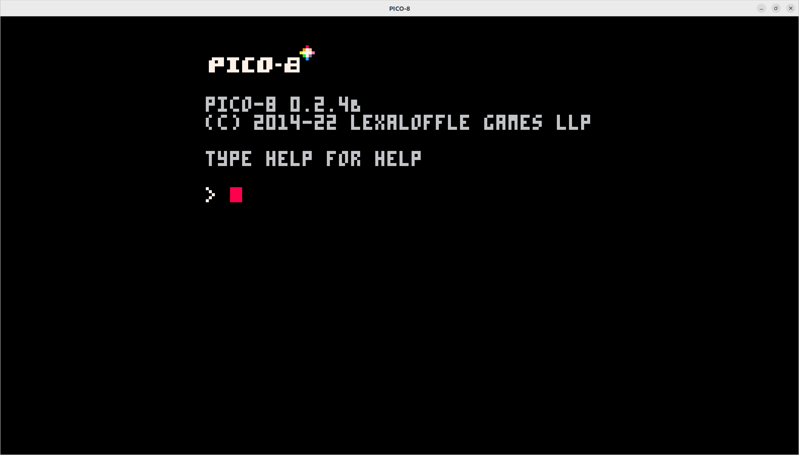
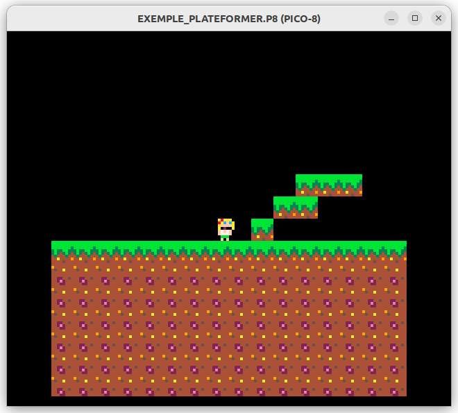
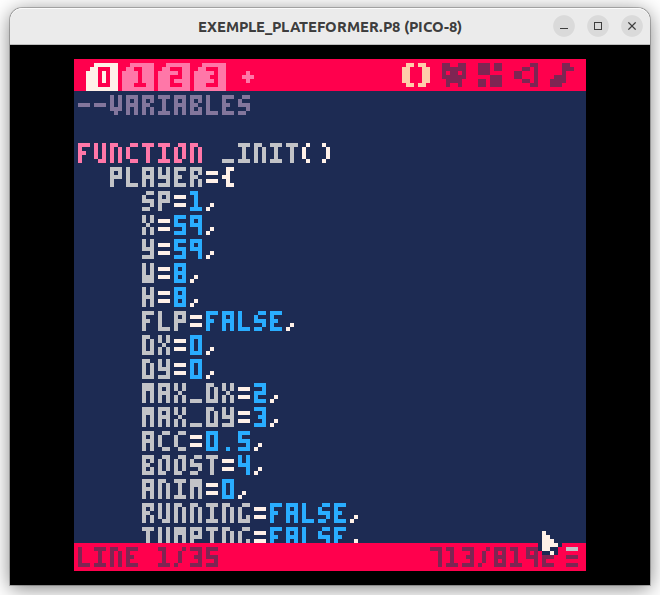

# INTRODUCTION <a name="Introduction"></a>

Tu as déja rêvé de faire ton propre jeu vidéo ? Et bien ce tuto est pour toi. Aujourd'hui on va apprendre à faire un jeu vidéo en 2D avec la librairie pico-8.

Vous n'avez pas besoin de lire tout ce tutoriel pour faire votre jeu. Vous pouvez vous arrêter à n'importe quel moment et faire votre propre jeu.

Ce tutoriel a pour but de vous expliquer comment marche le `example_plateformer.p8` et comment vous pouvez le modifier pour faire votre propre jeu. Voir même faire votre propre jeu (ce qui est recommandé).

Vous devez voir ce tuto comme une explication de comment marche le jeu fournis. Et non comme un tuto qui vous explique comment faire un jeu. 

## C'est quoi pico 8 ?

Pico 8 est une console virtuelle qui permet de faire des jeux vidéo en 2D. Elle est très simple d'utilisation et permet de faire des jeux très rapidement. Elle est disponible sur [pico-8](https://www.lexaloffle.com/pico-8.php) et sur [itch.io](https://itch.io/app/52122/pico-8).

Pico 8 utilise un langage de programmation très simple, le lua. Il est très simple d'utilisation et permet de faire des jeux très rapidement.

## C'est quoi lua ?

Lua est ce qu'on appelle un langage de script. c'est à dire des programmes qui vont être utilisés par d'autres programmes. Il est très simple d'utilisation et permet de faire des jeux très rapidement.

# SOMMAIRE

1. [Introduction](#Introduction)
2. [Installation](#Installation)
3. [Lancement de notre premier jeu](#Lancement)
4. [Edition de notre premier jeu](#Edition)
5. [Design de notre personnage](#Design)
6. [Création de notre map](#Map)
7. [Passons au code](#Code)
8. [A vous de jouer](#A_vous_de_jouer)

# INSTALLATION <a name="Installation"></a>

## Installation de pico 8

Pour installer pico 8, il suffit de télécharger le fichier .exe sur le site de [pico-8](https://www.lexaloffle.com/pico-8.php) et de l'installer.

Mais pour les biens de ce tuto, je vous fournis déja un .zip avec pico 8 dedans. Il suffit de le télécharger et de l'extraire dans un dossier.
Regardez dans le dossier `pico8` et vous devriez voir un fichier `windows.zip` ou `linux.zip` selon votre système d'exploitation.

## Lancement de pico 8

Quand vous lancez pico 8, vous devriez voir une fenêtre comme celle-ci :


On appelle ça un terminal, c'est un endroit ou vous pouvez entrer des commandes. Les commandes vous permettent de faire des actions. On vous donnera des commandes à entrer dans le terminal.

# LANCEMENT DE NOTRE PREMIER JEU

Vous aller commencer avec une première base de code. Il faut savoir que pico8 marche avec des fichiers .p8. Dans le dossier `jeux` vous aller avoir un fichier `exemple_plateformer.p8`.
Pour pouvoir lancer le jeu, il faut faire quelques étapes.

## 1. Chargement du fichier

Pour charger le fichier, il faut lancer la commande `folder`. Cela va vous ouvrir un dossier. Vous devez juste transférer le fichier `exemple_plateformer.p8` à l'intérieur.

## 2. Lancement du jeu

Normalement, si la première étape a été faite correctement, vous devriez voir le fichier `exemple_plateformer.p8` lorsque vous lancez la commande `ls`.
Si jamais ce n'est pas le cas, vous pouvez toujours faire la première étape à nouveau ou demander de l'aide.
Si tout est bon alors vous pouvez lancer le jeu en faisant la commande `load exemple_plateformer.p8` ainsi que la commande `run exemple_plateformer.p8`.
Ainsi, vous devriez voir le jeu s'ouvrir dans une nouvelle fenêtre.

Une image du jeu:


Actuellement vous pouvez vous déplacer avec les flèches du clavier. Vous pouvez aussi appuyer sur la touche `x` pour sauter.

Pour quitter le jeu, il vous suffit d'appuyer sur la touche `ECHAP`.

# EDITION DE NOTRE PREMIER JEU

Pour pouvoir modifier le jeu, il faut que nous l'ouvrions dans un éditeur de code. Il en existe des tonnes et libre à vous de choisir celui que vous voulez. Personnellement, j'utilise [Visual Studio Code](https://code.visualstudio.com/).
Mais si vous voulez rester dans le thème de pico 8, vous pouvez utiliser l'éditeur de code de pico 8. Pour cela, il faut appuyer sur la touche `ESC` pour ouvrir le menu de pico 8. Vous êtes maintenant dans l'IDE de pico 8.


## PRESENTATION DE L'IDE

L'IDE de pico 8 est composé de plusieurs parties. Il peux faire peur au début mais il est très simple d'utilisation.

### 1. La partie gauche

En haut à gauche vous avez plusieurs numéros (sur la capture d'écran, ils vont de 0 à 3). Ces numéros correspondent aux fichiers que pico8 à ouvert. Vous pouvez voir que le chaque fichier commence par:
```lua
-- NOM DU FICHIER
```
Si jamais vous utilisez un éditeur de code externe, vous n'avez pas cette séparation mais seulement un seul fichier avec plusieurs parties séparées ces mêmes entêtes.

### 2. La partie centrale

La partie centrale est la partie ou vous allez écrire votre code. Vous pouvez voir que le code est coloré. Cela permet de mieux voir les différentes parties du code.

### 3. La partie droite

En haut à droite est la partie ou vous allez ouvrir les différents menus de pico 8. Vous pouvez voir que le menu est composé de plusieurs parties. Voici les différentes parties du menu de gauche à droite:

- `IDE`: C'est le menu ou vous êtes actuellement. Il permet de modifier le code du jeu.
- `Sprites`: C'est le menu ou vous pouvez modifier les sprites du jeu.
- `Map`: C'est le menu ou vous pouvez modifier la map du jeu.
- `SFX`: C'est le menu ou vous pouvez modifier les effets sonores du jeu.
- `Music`: C'est le menu ou vous pouvez modifier les différentes musiques du jeu.

# DESIGN DE NOTRE PERSONNAGE

Pour pouvoir modifier le personnage, il faut aller dans le menu `Sprites`. Vous pouvez voir que le menu est composé de plusieurs parties qui sont assez simples d'utilisation.

Vous pouvez designez votre personnage comme vous voulez.

# DESIGN DE LA MAP

Une fois que les sprites sont designés, il faut les mettre dans la map. Pour cela, il faut aller dans le menu `Map`. Vous pouvez voir que le menu est composé de plusieurs parties qui sont assez simples d'utilisation.

# PASSONS AU CODE !

Maintenant que vous avez designé votre personnage et votre map, il faut passer au code. Pour cela, il faut aller dans le menu `IDE` et dans le fichier 0 (variables).
Voici une explication de chaque fichier:

## 1. Les variables (fichier 0)

Voici le code du fichier 0:
```lua
function _init()
  player={
    sp=1,
    x=59,
    y=59,
    w=8,
    h=8,
    flp=false,
    dx=0,
    dy=0,
    max_dx=2,
    max_dy=3,
    acc=0.5,
    boost=4,
    anim=0,
    running=false,
    jumping=false,
    falling=false,
    sliding=false,
    landed=false
  }

  gravity=0.3
  friction=0.85

  --simple camera
  cam_x=0

  --map limits
  map_start=0
  map_end=1024
end
```

### 1.1. La fonction `_init()`

La fonction `_init()` est la fonction qui est appelée au lancement du jeu. C'est ici que l'on va initialiser les variables.

### 1.2. La variable `player`

La variable `player` est un objet qui contient toutes les variables du joueur. Voici une explication de chaque variable:

- `sp`: C'est le sprite du joueur. Il est initialisé à 1 car le joueur est le sprite numéro 1.
- `x` et `y`: C'est la position du joueur. Il est initialisé à 59 car c'est la position de départ du joueur.
- `w` et `h`: C'est la largeur et la hauteur du joueur. Il est initialisé à 8 car c'est la largeur et la hauteur du sprite du joueur.
- `flp`: C'est la variable qui permet de savoir si le joueur est retourné. Il est initialisé à `false` car le joueur ne doit pas être retourné au début du jeu.
- `dx` et `dy`: C'est la vitesse du joueur. Il est initialisé à 0 car le joueur ne doit pas avoir de vitesse au début du jeu.
- `max_dx` et `max_dy`: C'est la vitesse maximale du joueur. Il est initialisé à 2 et 3 car c'est la vitesse maximale du joueur.
- `acc`: C'est l'accélération du joueur. Il est initialisé à 0.5 car c'est l'accélération du joueur.
- `boost`: C'est la vitesse de boost du joueur. Il est initialisé à 4 car c'est la vitesse de boost du joueur.
- `anim`: C'est la variable qui permet de savoir quelle animation du joueur est en cours. Il est initialisé à 0 car le joueur ne doit pas avoir d'animation au début du jeu.
- `running`: C'est la variable qui permet de savoir si le joueur est en train de courir. Il est initialisé à `false` car le joueur ne doit pas courir au début du jeu.
- `jumping`: C'est la variable qui permet de savoir si le joueur est en train de sauter. Il est initialisé à `false` car le joueur ne doit pas sauter au début du jeu.
- `falling`: C'est la variable qui permet de savoir si le joueur est en train de tomber. Il est initialisé à `false` car le joueur ne doit pas tomber au début du jeu.
- `sliding`: C'est la variable qui permet de savoir si le joueur est en train de glisser. Il est initialisé à `false` car le joueur ne doit pas glisser au début du jeu.
- `landed`: C'est la variable qui permet de savoir si le joueur est en train de atterrir. Il est initialisé à `false` car le joueur ne doit pas atterrir au début du jeu.

### 1.3. La variable `gravity`

La variable `gravity` est la gravité du jeu. Elle est initialisée à 0.3 car c'est la gravité du jeu.

### 1.4. La variable `friction`

La variable `friction` est la friction du jeu. Elle est initialisée à 0.85 car c'est la friction du jeu.

### 1.5. La variable `cam_x`

La variable `cam_x` est la position de la caméra. Elle est initialisée à 0 car la caméra est au début du jeu.

### 1.6. La variable `map_start` et `map_end`

La variable `map_start` et `map_end` sont les limites de la map. Elles sont initialisées à 0 et 1024 car la map fait 1024 pixels de large.

## 2. Les fonctions (fichier 1)

Voici le code du fichier 1:
```lua
function _update()
  player_update()   -- On met à jour le joueur
  player_animate()  -- On anime le joueur

  --simple camera
  -- On met à jour la position de la caméra et on vérifie sa position par rapport aux limites de la map
  -- 128 est la largeur de la caméra (128 pixels)
  cam_x=player.x-64+(player.w/2)
  if cam_x<map_start then
     cam_x=map_start
  end
  if cam_x>map_end-128 then
     cam_x=map_end-128
  end
  camera(cam_x,0)
end

function _draw()
  cls()     -- cls = clear screen
  map(0,0)
  spr(player.sp,player.x,player.y,1,1,player.flp) -- On dessine le joueur
end
```

Ce fichier contient les fonctions `_update()` et `_draw()`. Qui sont les fonctions qui sont appelées à chaque frame.

### 2.1. La fonction `_update()`

La fonction update est la fonction qui est appelée à chaque frame. C'est ici que l'on va mettre à jour les variables du jeu.
Par exemple, on met à jour la position du joueur, on anime le joueur, on met à jour la caméra, etc.

### 2.2. La fonction `_draw()`

La fonction draw est la fonction qui est appelée à chaque frame. C'est ici que l'on va dessiner le jeu.

## 3. Les collisions (fichier 2)

Le fichier 2 contient les fonctions qui permettent de gérer les collisions.

Voici le code du fichier 2:
```lua
function collide_map(obj,aim,flag)
 --obj = table needs x,y,w,h
 --aim = left,right,up,down

 local x=obj.x  local y=obj.y
 local w=obj.w  local h=obj.h

 -- Les variables x1, y1, x2 et y2 sont les coordonnées des coins de l'objet. (x1, y1) est le coin en haut à gauche et (x2, y2) est le coin en bas à droite.
 -- Ils représentent l'objet avec lequel on va vérifier les collisions.
 local x1=0	 local y1=0
 local x2=0  local y2=0

 -- Selon la direction on définit les coordonnées des coins de l'objet.
 if aim=="left" then
   x1=x-1  y1=y
   x2=x    y2=y+h-1

 elseif aim=="right" then
   x1=x+w-1    y1=y
   x2=x+w  y2=y+h-1

 elseif aim=="up" then
   x1=x+2    y1=y-1
   x2=x+w-3  y2=y

 elseif aim=="down" then
   x1=x+2      y1=y+h
   x2=x+w-3    y2=y+h
 end

 --pixels to tiles
 -- On divise les coordonnées des coins par 8 car les tiles font 8 pixels de large et de haut.
 -- Comme ça on obtient les coordonnées des tiles sur la map.
 x1/=8    y1/=8
 x2/=8    y2/=8

 -- On vérifie si les tiles sur lesquels se trouve l'objet ont le flag `flag`.
 -- Autrement dit on vérifie si les tiles sur lesquels se trouve l'objet sont des tiles auquel on veut appliquer les collisions.
 if fget(mget(x1,y1), flag)
 or fget(mget(x1,y2), flag)
 or fget(mget(x2,y1), flag)
 or fget(mget(x2,y2), flag) then
   return true
 else
   return false
 end

end
```

Les `local` sont des variables locales. Elles ne sont pas accessibles depuis l'extérieur de la fonction.
les fonctions `fget()` et `mget()` permettent de récupérer des informations sur les tiles de la map.

### 3.1. La fonction `collide_map()`

La fonction `collide_map()` permet de savoir si un objet entre en collision avec un tile de la map. Elle prend 3 paramètres:
- `obj`: C'est l'objet qui va entrer en collision avec un tile de la map. C'est une table qui contient les variables `x`, `y`, `w` et `h`.
- `aim`: C'est la direction dans laquelle l'objet va entrer en collision avec un tile de la map. C'est une chaîne de caractères qui peut être `left`, `right`, `up` ou `down`.
- `flag`: C'est le flag du tile de la map. C'est un nombre qui peut être 0, 1, 2, 3, 4, 5, 6, 7, 8, 9, 10, 11, 12, 13, 14 ou 15. Chaque flag correspond à un type de tile. Par exemple, le flag 1 correspond aux tiles qui sont des sols.

## 4. Le joueur (fichier 3)

Le fichier 3 contient les fonctions qui permettent de gérer le joueur. C'est de loin le fichier le plus important.

Voici le code du fichier 3:
```lua
function player_update()
  --physics
  player.dy+=gravity
  player.dx*=friction

  --controls
  if btn(⬅️) then
    player.dx-=player.acc
    player.running=true
    player.flp=true
  end
  if btn(➡️) then
    player.dx+=player.acc
    player.running=true
    player.flp=false
  end

  --slide
  if player.running
  and not btn(⬅️)
  and not btn(➡️)
  and not player.falling
  and not player.jumping then
    player.running=false
    player.sliding=true
  end

  --jump
  if btnp(❎)
  and player.landed then
    player.dy-=player.boost
    player.landed=false
  end

  --check collision up and down
  if player.dy>0 then
    player.falling=true
    player.landed=false
    player.jumping=false

    player.dy=limit_speed(player.dy,player.max_dy)

    if collide_map(player,"down",0) then
      player.landed=true
      player.falling=false
      player.dy=0
      player.y-=((player.y+player.h+1)%8)-1
    end
  elseif player.dy<0 then
    player.jumping=true
    if collide_map(player,"up",1) then
      player.dy=0
    end
  end

  --check collision left and right
  if player.dx<0 then

    player.dx=limit_speed(player.dx,player.max_dx)

    if collide_map(player,"left",1) then
      player.dx=0
    end
  elseif player.dx>0 then

    player.dx=limit_speed(player.dx,player.max_dx)

    if collide_map(player,"right",1) then
      player.dx=0
    end
  end

  --stop sliding
  if player.sliding then
    if abs(player.dx)<.2
    or player.running then
      player.dx=0
      player.sliding=false
    end
  end

  player.x+=player.dx
  player.y+=player.dy

  --limit player to map
  if player.x<map_start then
    player.x=map_start
  end
  if player.x>map_end-player.w then
    player.x=map_end-player.w
  end
end

function player_animate()
  if player.jumping then
    player.sp=7
  elseif player.falling then
    player.sp=8
  elseif player.sliding then
    player.sp=9
  elseif player.running then
    if time()-player.anim>.1 then
      player.anim=time()
      player.sp+=1
      if player.sp>6 then
        player.sp=3
      end
    end
  else --player idle
    if time()-player.anim>.3 then
      player.anim=time()
      player.sp+=1
      if player.sp>2 then
        player.sp=1
      end
    end
  end
end

function limit_speed(num,maximum)
  return mid(-maximum,num,maximum)
end
```

C'est un gros morceau de code. Mais on peux voir qu'il est divisé en 2 parties:
- La partie `player_update()`
- La partie `player_animate()`
Il y a aussi la fonction `limit_speed()` qui est appelée dans la partie `player_update()`. Cette fonction permet de limiter la vitesse d'un objet grâce à la fonction `mid()` qui renvoie la valeur qui se trouve entre 2 autres valeurs.

Ce fichier c'est à vous de le comprendre. Mais je vais quand même vous expliquer les choses les plus importantes.

- La fonction `time()` renvoie le temps en secondes depuis le début du jeu. C'est une fonction qui est fournie par PICO-8.
- La fonction `btn()` renvoie `true` si une touche est enfoncée. C'est une fonction qui est fournie par PICO-8.
- La fonction `btnp()` renvoie `true` si une touche vient d'être enfoncée. C'est une fonction qui est fournie par PICO-8.
- La fonction `abs()` renvoie la valeur absolue d'un nombre. C'est une fonction qui est fournie par PICO-8.
- La fonction `mid()` renvoie la valeur qui se trouve entre 2 autres valeurs. C'est une fonction qui est fournie par PICO-8.

N'ayez pas peur de regarder le code et de passer du temps à le comprendre. C'est la meilleure façon d'apprendre.

# A VOUS DE JOUER !

Maintenant que vous avez tout le code, vous pouvez le modifier et le personnaliser. Vous pouvez aussi ajouter des fonctionnalités. Par exemple, vous pouvez ajouter un système de score, de vies, de niveaux, etc.

Le but de ce tutoriel est de vous expliquer comment marche le code. Mais le but de cette séance est que vous vous amusiez à coder. Vous pouvez donc faire ce que vous voulez.
